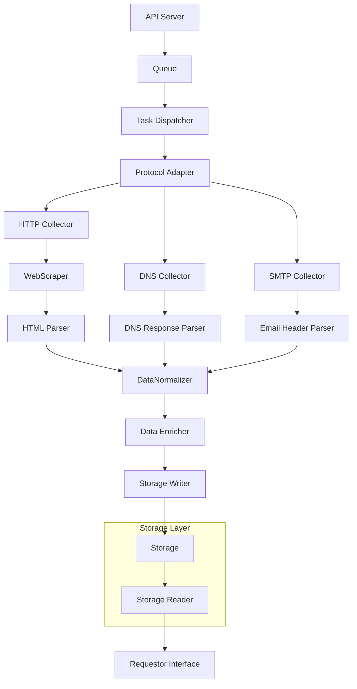

# geoip-detector

GeoIP Detector is a tool for obtaining a range of information about an http endpoint.
It provides HTTP status, page hash, screenshot, server ip for different regions of the world provided by your VPN.

## Requirements

Before building and running the project, ensure you have the following installed:

1. **Go (version 1.22.3 or higher)**
    - [Install Go](https://go.dev/doc/install)

2. **Mullvad VPN**
    - [Install Mullvad VPN](https://mullvad.net/fr/help/install-mullvad-app-linux)

### Configure Mullvad VPN

Login to your Mullvad VPN account using the command below:

```bash
mullvad account login XXXX-XXXX-XXXX-XXXX
```

## Build Project

To build the project, use the following command:

```bash
make
```

## Run Project

After building the project, you can run the GeoIP Detector with the following command:

```bash
./bin/geoip-detector -endpoint=http://onsager.net 
```

---

**Note:** Remember to replace `XXXX-XXXX-XXXX-XXXX` with your actual Mullvad VPN account token.

## Architecture

### Sequence Diagram


